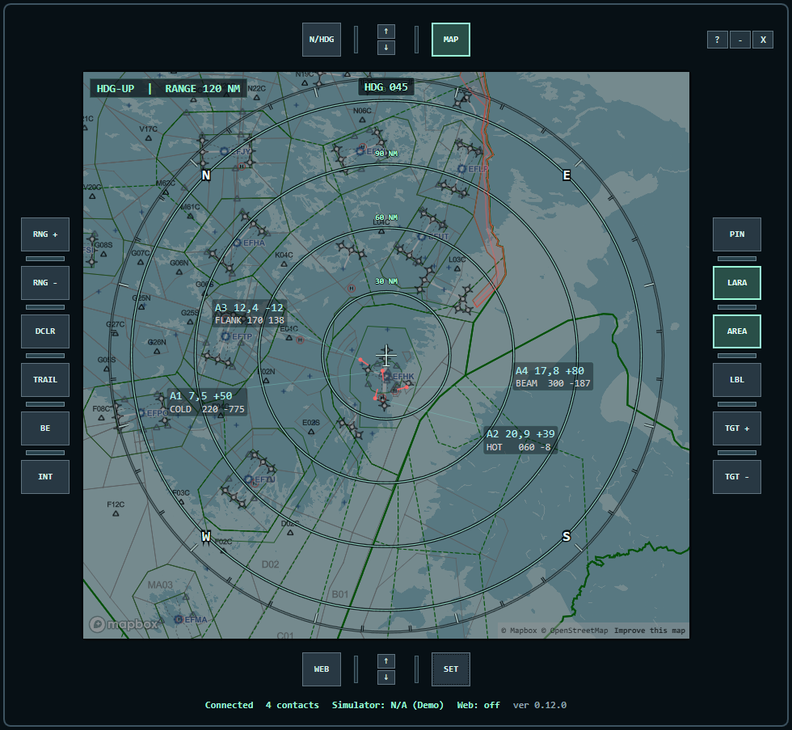

# Virtual Tactical Situation Display

Virtual Tactical Situation Display is a Windows application that shows the air picture around your aircraft in a clear 2D view.

**This application is intended for simulator use only.
It is not intended for real-world aviation, air traffic control, or operational decision-making.**

The application is designed to present a tactical air picture and can show, for example:
- your own aircraft position and heading
- nearby traffic
- separately marked friends, package members, and support aircraft
- target range, altitude difference, and bearing

## Screenshot

## Quick Start

1. Download the latest release from the GitHub Releases page.
2. Start `TacticalDisplay.App.exe`.
3. Try `Demo` mode first.
4. If you want to use simulator data, switch `Source` to `MSFS`, `XPlane 12`, or `Xplane Legacy (XPUIPC)` and click `Apply Source`.

## Requirements

- a Windows PC
- Microsoft Flight Simulator, if you want to use live MSFS data
- X-Plane 10, 11, or 12 with XPUIPC installed, if you want to use live X-Plane data

## First Use

When the application starts for the first time:
- the default mode is `Demo`
- the view shows test traffic
- the settings panel is visible on the right
- the application creates the required config files automatically

Demo mode is useful for checking how the display looks and how the controls work.

## Operating Modes

The application has two operating modes:

- `Demo` shows test data
- `MSFS` uses Microsoft Flight Simulator data through SimConnect
- `XPlane 12` uses the X-Plane 12 local Web API
- `Xplane Legacy (XPUIPC)` uses X-Plane data through XPUIPC

You can change the mode from the settings panel:

1. Select the mode you want in `Source`.
2. Click `Apply Source`.
3. If you want to keep the selection for the next launch, click `Save Settings`.

## MSFS Support

SimConnect is bundled with the application. The user does not need to install or copy `SimConnect.dll` separately.

If Microsoft Flight Simulator is running and the application is set to `MSFS`, the connection should work normally without extra setup.

If the connection cannot be established, the application may ask you to select the Microsoft Flight Simulator `exe` file or a SimConnect library. This is intended only for troubleshooting.

## X-Plane Support

X-Plane support uses XPUIPC.

Basic setup:

1. Download XPUIPC from [schiratti.com/xpuipc.html](http://www.schiratti.com/xpuipc.html).
2. Extract the `XPUIPC` folder into `X-Plane\Resources\plugins`.
3. Start X-Plane and load into a flight.
4. In Tactical Situation Display, select `Source = Xplane Legacy (XPUIPC)` and click `Apply Source`.

If X-Plane is already running with XPUIPC installed, the application should connect automatically.

## Using The Display

The main view is a tactical display centered on your own aircraft.

You can change the view directly from the application:
- `Range +` and `Range -` change the visible range
- `N/HDG` switches between north-up and heading-up orientation
- `Declutter` reduces the amount of information shown on screen
- `Labels` changes the label mode
- `Trails` shows or hides target trails

## Labels And Symbols

Target symbols indicate their type:
- friend = circle
- package = diamond
- support = square
- enemy = cross
- unknown = dot

Labels have three modes:
- `Full` shows more information
- `Minimal` shows the most important information
- `Off` hides labels

## Editing Targets With The Mouse

You can edit a single target directly in the display:

- **left mouse button** on a target changes the target affiliation: normal -> friendly -> enemy -> normal
- **right mouse button** on a target opens target renaming
- **drag label with left mouse button** to move a single label
- **middle mouse button** on a target or label toggles that label visible/hidden

These changes are saved to the application config files.

## Keyboard Shortcuts

The application also has a few keyboard shortcuts:

- `Ctrl+H` shows or hides the settings panel
- `Ctrl+D` toggles declutter mode
- `Ctrl+T` pins the window on top of other windows or removes the pin

## Status Bar

The bottom status bar shows current status information such as:

- whether the connection is established
- how many targets are visible
- simulator link status
- refresh rate
- active data source

## Saving Settings

You can change normal settings directly in the application. If you want to keep the changes for the next launch, click `Save Settings`.

The application also saves settings when it closes.

## Config Files

On first launch, the application automatically creates a `config` folder next to the `exe` file.

The most important files are:
- `config/display.json` contains general display and data source settings
- `config/friends.json` contains callsigns marked as friends
- `config/package.json` contains callsigns for the package group
- `config/support.json` contains callsigns for the support group
- `config/manual-targets.json` contains manually assigned names and affiliations

For most users, the built-in UI is enough and the files do not need to be edited manually.

## If The Connection Does Not Work

First check:
- Microsoft Flight Simulator is running when using `MSFS`
- X-Plane 12 is running with the local Web API enabled when using `XPlane 12`
- X-Plane is running with XPUIPC when using `Xplane Legacy (XPUIPC)`
- the application is in the correct simulator mode
- you are using the latest published version

If the connection still does not work:
1. close Virtual Tactical Situation Display
2. make sure the simulator is running
3. start Tactical Situation Display again

## Debug Logging

When using `MSFS`, `XPlane 12`, or `Xplane Legacy (XPUIPC)`, the application writes a datasource debug log to:

- `config/logs/data-source-debug.log`

The log includes:
- connection open and close attempts
- simulator feed errors and reconnects
- throttled ownship and traffic sample summaries
- snapshot and traffic refresh summaries

Debug logging is controlled by the in-app setting `Enable datasource debug log` and persisted in `config/display.json` as `EnableDataSourceDebugLogging`.

## Intended Use

This application is intended for users who want a quick, readable tactical picture around their own aircraft without heavy setup or separate SimConnect configuration.
**The application is intended for simulator use only and not for real-world aviation use.**
