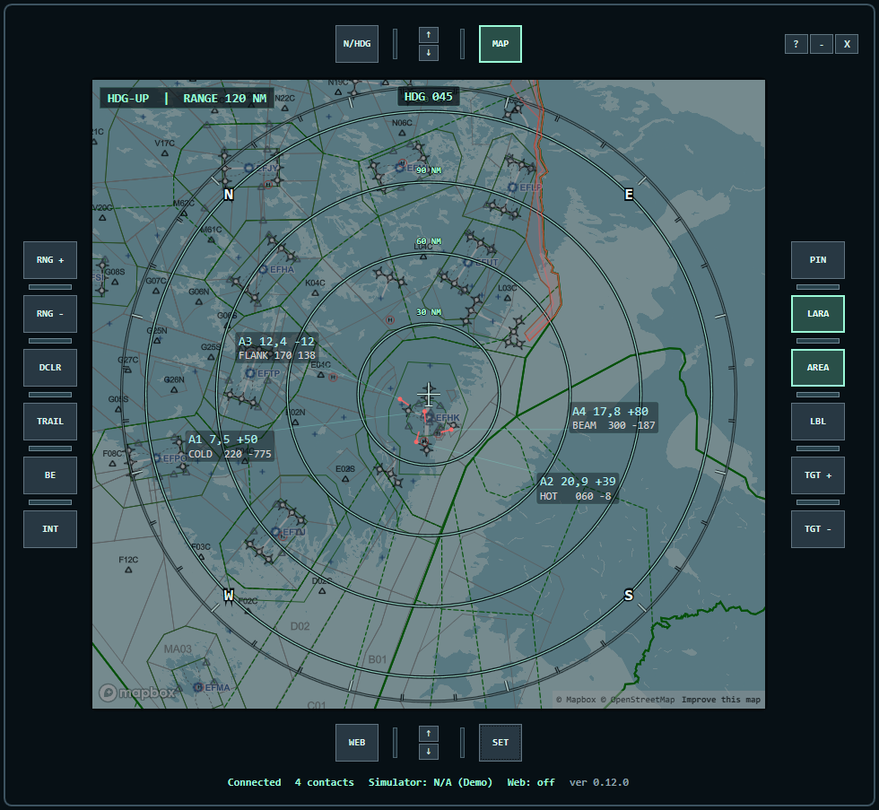

# Virtual Tactical Situation Display

Virtual Tactical Situation Display (VTSD) is a Windows app that shows a simple tactical air picture around your own simulator aircraft.

**Simulator use only. Not for real-world aviation, air traffic control, or operational decision-making.**

## Features

- ownship and nearby simulator traffic
- support for MSFS, X-Plane 12, legacy X-Plane/XPUIPC, and Demo mode
- friend, package, support, enemy, and unknown target symbols
- map, trails, declutter, bullseye, and active V-LARA airspace overlays
- VTSD Cloud for synced collections, kneepad pages, and map features
- kneepad for mission text, images, URL pages, and Cloud pages
- tablet web display on the local network
- global keyboard and gamepad hotkeys

## Requirements

- Windows
- Microsoft Edge WebView2 Runtime
- a supported simulator if you want live traffic data

SimConnect is bundled for Microsoft Flight Simulator. X-Plane 12 uses its local Web API. Legacy X-Plane support requires XPUIPC.

## Quick Start

1. Download and extract the latest VTSD release.
2. Start `TacticalDisplay.App.exe`.
3. Use `Demo` first to check that the display works.
4. Open `SET`.
5. Select `MSFS`, `XPlane 12`, or `Xplane Legacy (XPUIPC)`.
6. Click `Apply Source`.

## VTSD Cloud

Open `SET` > `VTSD Cloud` to sign in with VATSIM.

Cloud can sync authorized collections, redeem share codes, cache content for offline use, and show synced kneepad pages or map features in VTSD.

## Main Controls

- `RNG +` / `RNG -`: change range
- `N/HDG`: switch north-up / heading-up
- `MAP`: show or hide the map
- `DCLR`: reduce clutter
- `TRAIL`: show or hide trails
- `BE`: show or hide bullseye
- `LARA`: show or hide active V-LARA airspace
- `AREA`: show or hide controlled airspace map style
- `INT`: select or clear an intercept target
- `LBL`: cycle label detail
- `KNEE`: show or hide kneepad
- `WEB`: show or hide tablet web display
- `SET`: show or hide settings
- `PIN`: keep the window on top

Click a target to cycle its affiliation. Right click a target or label to rename it. Drag a label to move it. Middle click a target or label to hide or show that label.

## Tablet Display

Turn on `WEB`, then open the `Web: http://...:8787/` address shown in the app footer from a tablet or another device on the same local network.

If the tablet cannot connect, allow VTSD through Windows Firewall for private networks and check that both devices are on the same network.

## Kneepad

Open the kneepad with `KNEE` or `Ctrl+K`.

Kneepad pages can contain mission text, imported images, URL pages, and synced VTSD Cloud kneepad pages. Use `<` / `>` or `Ctrl+PageUp` / `Ctrl+PageDown` to change pages.

## Hotkeys

Open `SET` > `Hotkeys` > `Configure Hotkeys` to change keyboard and XInput gamepad bindings.

Common default keyboard bindings:

- `Ctrl+H`: settings
- `Ctrl+D`: declutter
- `Ctrl+T`: pin window on top
- `Ctrl+K`: kneepad
- `Ctrl+PageUp` / `Ctrl+PageDown`: kneepad pages

## Troubleshooting

If live data does not appear, check that the correct source is selected, the simulator is running, and the required simulator interface is enabled.

For X-Plane 12, check that the local Web API is available at `http://localhost:8086/`. For legacy X-Plane, check that XPUIPC is installed in `X-Plane\Resources\plugins`.

If the map says `Map unavailable`, install or repair Microsoft Edge WebView2 Runtime.

Debug logs are written to `%APPDATA%\VirtualTacticalSituationDisplay\logs\debug.log` when Debug is enabled in settings.

## License

This project is licensed under the terms in `LICENSE`.
